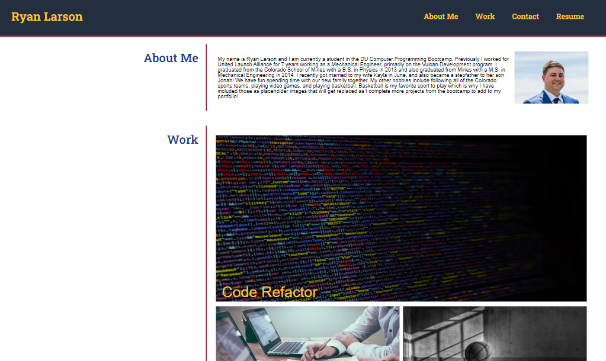

# Module2 Challenge: Portfolio

## Description

Write code from scratch for a portfolio webpage displaying a students projects that were completed during the coding bootcamp. The page will also give background on the student and contact information

## Tasks accomplished

<ul>
    <li>Created navbar which links to each section of the page.</li>
    <li>Used flex box to format pictures and sections on the page.</li>
    <li>Formatted page layout to change displays on different screen sizes</li>
    <li>Added alt text to all images to add accessibility descriptions to images</li>
    <li>Used CSS variables to re-use all colors seen on the web page</li>
</ul>

## Website Link

Link to deployed website is [Ryan Larson Portfolio](https://larsonrj.github.io/ryan-larson-portfolio/)

## Website Preview

## Future Improvements

<ul>
    <li> Add to work projects and remove placeholder images.</li>
    <li> Format contact info to fit better on smaller mobile screens</li>